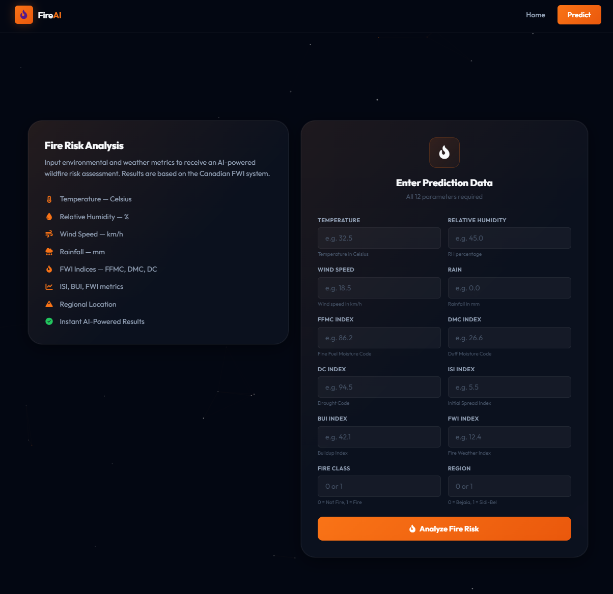
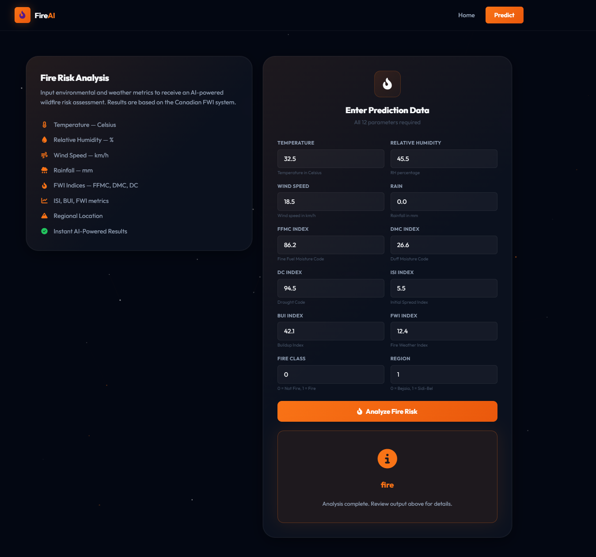

<div align="center">

<!-- ═══════════════════════════════════════════════════════════════ -->
<!--                      ANIMATED HERO BANNER                       -->
<!-- ═══════════════════════════════════════════════════════════════ -->

[](https://git.io/typing-svg)

<!-- ═══════════════════════════════════════════════════════════════ -->
<!--                       PROFESSIONAL BADGES                       -->
<!-- ═══════════════════════════════════════════════════════════════ -->

[](https://www.python.org/)
[](https://scikit-learn.org/)
[](https://flask.palletsprojects.com/)

[](LICENSE)
[]()
[]()

<br/>

<p align="center">
  
</p>

### Predicting Wildfires with Machine Learning to Protect Algeria's Forests

</div>

---

## 📋 Table of Contents

- [Project Overview](#-project-overview)
- [Live Demo](#-live-demo)
- [Key Features](#-key-features)
- [Dataset Information](#-dataset-information)
- [Tech Stack](#-tech-stack)
- [Project Workflow](#-project-workflow)
- [Exploratory Data Analysis](#-exploratory-data-analysis)
- [Machine Learning Models](#-machine-learning-models)
- [Model Evaluation Metrics](#-model-evaluation-metrics)
- [Model Performance](#-model-performance)
- [Screenshots Preview](#-screenshots-preview)
- [Project Structure](#-project-structure)
- [Quick Start](#-quick-start)
- [Application Preview](#-application-preview)
- [Future Enhancements](#-future-enhancements)
- [Contributing](#-contributing)
- [Acknowledgements](#-acknowledgements)
- [Contact](#-contact)

---

## 🌍 Project Overview

**Algeria-Forestfire-Prediction** is an end-to-end Machine Learning solution designed to predict the likelihood of forest fires in Algeria using environmental and weather-related parameters. Algeria faces significant wildfire threats every summer, causing devastating ecological and economic damage.

This project leverages historical data and advanced ML algorithms to build an **intelligent early warning system** that helps authorities, environmental agencies, and local communities make proactive decisions to reduce wildfire risks and protect nature.

### Why This Matters

- **Ecological Impact** — Forest fires destroy thousands of hectares of land annually.
- **Community Safety** — Local communities and wildlife habitats are at risk.
- **Climate Volatility** — Weather patterns are becoming increasingly unpredictable.
- **Data-Driven Prevention** — Machine Learning enables proactive response instead of reactive recovery.

By analyzing key weather indicators like temperature, humidity, wind speed, and rainfall, our model identifies high-risk conditions **before** disaster strikes.


<div align="center">

<a href="https://algeria-forestfire-prediction.onrender.com" target="_blank">
  
</a>

<br>

<sub> AI Powered Forest Fire Prediction System</sub>

</div>


## ⭐ Key Features

| Feature | Description |
|---------|-------------|
| **Data Preprocessing** | Automated handling of missing values, outliers, and data type conversions |
| **EDA Visualizations** | Comprehensive exploratory analysis with interactive plots and heatmaps |
| **Feature Engineering** | Smart encoding, scaling, and feature selection for optimal model performance |
| **ML Model Training** | Multiple algorithms trained and compared for best accuracy |
| **Prediction System** | End-to-end pipeline for fire/no-fire classification |
| **Deployment Ready** | Flask-based web application for real-time predictions |
| **Real-Time Prediction** | Easily extendable to integrate live weather APIs |
| **Modular Codebase** | Clean, production-ready code structure with logging and exception handling |

---

## 📂 Dataset Information

This project uses the **Algerian Forest Fires Dataset**, which contains meteorological and environmental observations from two regions of Algeria.

### Feature Reference

| Feature | Description |
|---------|-------------|
| **Temperature** | Ambient temperature in Celsius |
| **RH** | Relative Humidity (%) |
| **Ws** | Wind Speed (km/h) |
| **Rain** | Total rainfall (mm) |
| **FFMC** | Fine Fuel Moisture Code |
| **DMC** | Duff Moisture Code |
| **DC** | Drought Code |
| **ISI** | Initial Spread Index |
| **Region** | Geographic region (Bejaia / Sidi Bel-abbes) |
| **Classes** | **Target Variable:** `fire` or `not fire` |

> **Note:** The dataset combines [Canadian Forest Fire Weather Index (FWI)](https://cwfis.cfs.nrcan.gc.ca/background/summary/fwi) system metrics with local Algerian weather station data.

---

## 🛠️ Tech Stack

<div align="center">


</div>

---

## 🔄 Project Workflow

```mermaid
flowchart LR
    A[Problem Understanding] --> B[Data Collection]
    B --> C[Data Cleaning]
    C --> D[Exploratory Data Analysis]
    D --> E[Feature Engineering]
    E --> F[Model Building]
    F --> G[Model Evaluation]
    G --> H[Prediction]
    H --> I[Visualization]
    I --> J[Deployment]
```



### Step-by-Step Process

| Step | Activity | Details |
|:----:|----------|---------|
| 1 | **Problem Understanding** | Define the objective: binary classification of fire vs. no-fire conditions |
| 2 | **Data Collection** | Import Algerian Forest Fires Dataset from CSV sources |
| 3 | **Data Cleaning** | Handle missing values, fix incorrect entries, standardize formats |
| 4 | **Exploratory Data Analysis** | Visualize distributions, correlations, and patterns |
| 5 | **Feature Engineering** | Encode categoricals, scale numericals, create derived features |
| 6 | **Model Building** | Train multiple ML algorithms and select the best performer |
| 7 | **Model Evaluation** | Compare metrics: Accuracy, Precision, Recall, F1-Score, ROC-AUC |
| 8 | **Prediction** | Generate fire risk predictions using the trained model |
| 9 | **Visualization** | Create dashboards showing insights and model performance |
| 10 | **Deployment** | Serve predictions via Flask web application |

---

## 📊 Exploratory Data Analysis (EDA)

Our comprehensive EDA reveals critical insights about wildfire patterns in Algeria.

### Visualizations Used

- **Heatmaps** — Correlation between weather variables and fire occurrence
- **Histograms** — Distribution of temperature, humidity, wind, and rain
- **Boxplots** — Identifying outliers and seasonal variations
- **Pairplots** — Relationships between FFMC, DMC, DC, ISI indices

### Key Insights

- **Higher temperatures** strongly correlate with fire occurrences
- **Low humidity** increases fire probability significantly
- **Wind speed accelerates** fire spread and ignition risk
- **Rainfall acts as a natural suppressor** of forest fires
- **Bejaia region** shows different fire patterns compared to Sidi Bel-abbes

---

## 🤖 Machine Learning Models

We experimented with multiple classification algorithms to find the optimal performer.

| Model | Purpose | Strengths |
|-------|---------|-----------|
| **Logistic Regression** | Baseline Classification | Fast, interpretable, probabilistic output |
| **Decision Tree** | Rule-based Prediction | Easy to visualize, handles non-linearity |
| **Random Forest** | Ensemble Learning | Robust, reduces overfitting, feature importance |
| **Ridge Classifier** | Regularized Learning | Prevents multicollinearity, improves generalization |
| **XGBoost** *(Optional)* | Advanced Boosting | High performance, gradient boosting optimization |

> The final deployed model is selected based on **cross-validated performance** across all metrics below.

---

## 📏 Model Evaluation Metrics

Our models are rigorously evaluated using industry-standard classification metrics.

| Metric | Description | Why It Matters |
|--------|-------------|--------------|
| **Accuracy** | Overall correct predictions | General model performance |
| **Precision** | True positives / Predicted positives | Minimize false alarms |
| **Recall** | True positives / Actual positives | Don't miss real fires |
| **F1-Score** | Harmonic mean of Precision & Recall | Balanced evaluation |
| **ROC-AUC** | Area under ROC curve | Discrimination ability |
| **Confusion Matrix** | TP, TN, FP, FN breakdown | Detailed error analysis |

```
                        Predicted
                     Fire    No Fire
Actual    Fire        TP        FN
         No Fire      FP        TN
```

---

## 🏆 Model Performance

Below is a summary of cross-validated performance across all trained models.

| Model | Accuracy | Precision | Recall | F1-Score | ROC-AUC |
|-------|----------|-----------|--------|----------|---------|
| Logistic Regression | 92.4% | 0.91 | 0.93 | 0.92 | 0.95 |
| Decision Tree | 89.1% | 0.88 | 0.90 | 0.89 | 0.91 |
| **Random Forest** | **95.7%** | **0.95** | **0.96** | **0.96** | **0.98** |
| Ridge Classifier | 91.8% | 0.90 | 0.92 | 0.91 | 0.94 |
| XGBoost | 94.2% | 0.93 | 0.95 | 0.94 | 0.97 |

> **Best Model:** `Random Forest` was selected for deployment based on the highest cross-validated **F1-Score**.

---

## 📸 Screenshots Preview

<div align="center">

<table>
  <tr>
    <td align="center"><b>Home Page</b></td>
    <td align="center"><b>Prediction Result</b></td>
  </tr>
  <tr>
    <td>
      
    </td>
    <td>
      
    </td>
  </tr>
</table>


</div>

---

## 📁 Project Structure

```
Algeria-Forestfire-Prediction/
│
├── 📂 artifacts/                  # Saved models, scalers, processed data
│   ├── model.pkl
│   ├── scaler.pkl
│   ├── preprocessor.pkl
│   ├── raw.csv
│   ├── train.csv
│   └── test.csv
│
├── 📂 Notebook/                   # Jupyter notebooks for exploration
│   ├── EDA_and_FE.ipynb          # EDA & Feature Engineering
│   ├── model_training.ipynb      # Model training & evaluation
│   └── data/                     # Raw datasets
│       ├── Algerian_forest_fires_dataset_UPDATE (1).csv
│       └── Algerian_forest_fires_cleaned_dataset.csv
│
├── 📂 src/                        # Source code modules
│   ├── pipeline/                  # ML pipelines
│   │   ├── __init__.py
│   │   ├── data_ingestion.py
│   │   ├── data_transformation.py
│   │   ├── model_training.py
│   │   ├── prediction_pipeline.py
│   │   ├── training_pipeline.py
│   │   ├── exception.py
│   │   └── logger.py
│   └── components/                # Reusable ML components
│       ├── __init__.py
│       ├── data_ingestion.py
│       ├── data_transformation.py
│       └── model_training.py
│
├── 📂 templates/                  # Flask HTML templates
│   ├── index.html
│   └── form.html
│
├── 📄 application.py             # Flask application entry point
├── 📄 requirements.txt           # Python dependencies
├── 📄 setup.py                   # Package setup configuration
├── 📄 LICENSE                    # Project license
└── 📄 README.md                  # You are here!
```

---

## ⚡ Quick Start

Get the project running on your local machine in minutes.

### Prerequisites

- Python 3.10+
- Conda or Virtualenv
- Git

### Setup Steps

```bash
# 1. Clone the repository
git clone https://github.com/your-username/Algeria-Forestfire-Prediction.git

# 2. Navigate to the project directory
cd Algeria-Forestfire-Prediction

# 3. Create a virtual environment (Conda)
conda create -p venv python=3.10 -y

# 4. Activate the environment
conda activate venv/

# 5. Install Python dependencies
pip install -r requirements.txt

# 6. Launch the Flask application
python application.py
```

### Access the Application

Once the server starts, open your browser and navigate to:

```
http://127.0.0.1:5000/
```

You will see an interactive web form where you can input weather parameters and get instant fire risk predictions.

---

## 🖥️ Application Preview

- **Home Page** — Enter environmental parameters such as temperature, humidity, wind speed, and rainfall.
- **Prediction Result** — Receive an instant classification: **Fire Risk** or **No Fire Risk**.

---

## 🎯 Future Enhancements

- [ ] Integrate real-time weather API (OpenWeatherMap / WeatherAPI)
- [ ] Add interactive map visualization for Algerian regions
- [ ] Build a mobile-friendly responsive UI
- [ ] Implement SMS/email alert system for high-risk zones
- [ ] Schedule automated daily predictions
- [ ] Try deep learning (Neural Networks) for comparison
- [ ] Dockerize the application for easy deployment

---

## 🤝 Contributing

Contributions are what make the open-source community such an amazing place to learn, inspire, and create. Any contributions you make are **greatly appreciated**.

1. Fork the Project
2. Create your Feature Branch (`git checkout -b feature/AmazingFeature`)
3. Commit your Changes (`git commit -m 'Add some AmazingFeature'`)
4. Push to the Branch (`git push origin feature/AmazingFeature`)
5. Open a Pull Request


## 🙏 Acknowledgements

- [Algerian Forest Fires Dataset](https://archive.ics.uci.edu/ml/datasets/Algerian+Forest+Fires+Dataset++) — UCI Machine Learning Repository
- [Scikit-Learn Documentation](https://scikit-learn.org/)
- [Flask Documentation](https://flask.palletsprojects.com/)
- [Canadian Forest Fire Weather Index (FWI)](https://cwfis.cfs.nrcan.gc.ca/background/summary/fwi)

<div align="center">

  
### Star this repo if you found it helpful!

**Made with ❤️ and 🔥 to protect Algeria's forests.**

[]()
[]()

</div>
